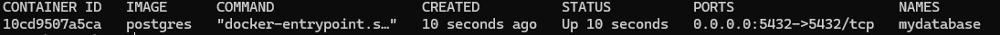
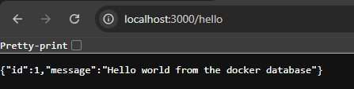

# Connect a Database Docker Container with a Node.js App Container

## Introduction

When you have two Docker containers, one runs a database, and the other runs an application that needs to be connected to the database. You can’t connect it using the [localhost](http://localhost/) address even if both Dockers run on the same machine. That is because each container has its own file system, network capabilities, and so on. Therefore, if you refer to localhost, it will search within the container (Which can’t be found).

The short answer is that both containers should be running on the same Docker network, and use the name of the database container as your `HOST` connection inside the app.

The rest of this blog is an example of how to do it.

> **Note:** If the database is running on your machine (Not a Docker container), you can use `host.docker.internal` as the `HOST` of your connection and you don’t need to read this blog.

## Pre-requisites

I have created a small project which you can clone from GitHub, and test the method.

The project is a simple Express.js API connected to a database.

Clone the project:

```terminal
git clone https://github.com/AzaKamala/docker-app-example.git
```

## Prepare The Docker Images

### Database Docker Image

The docker image is ready for PostgreSQL, you just need to pull the image.

```terminal
docker pull postgres
```

### Application Docker Image

Make sure you are in the project you just pulled using the terminal. Then, you need to create the docker image using the following command:

```terminal
docker build -t docker-app-example .
```

## Run The Docker Containers

### Database Docker Container

Run the following command to run the docker container:

```terminal
docker run -d --name mydatabase -p 5432:5432 -e POSTGRES_PASSWORD=[yourpassword] postgres
```

To check if the container is running run this command:

```terminal
docker ps
```



After this, you need to create the database, so run this command to access the PostgreSQL container:

```terminal
docker exec -it mydatabase psql -U postgres
```

then, create the database:

```terminal
CREATE DATABASE docker_app_example;
```

### Application Docker Container

Before you run the container, make sure to add the environment variables (In a `.env` file) inside the source code of the project according to the `.env.example`. However, one of the important parts of this process is the name of the host inside of the `.env`. We will assign the database container name `mydatabase` to the `HOST` variable.

```note
DB_NAME=docker_app_example
DB_HOST=mydatabase
DB_USER=postgres
DB_PASSWORD=[The password you set for your database]
```

After adding the environment variables, we can run the image on a container using the environment variable we created.

```terminal
docker run --name api-docker-app -p 3000:3000 --env-file .env docker-app-example
```

> The `.env` file is in the directory that I am running this command, if yours is in another directory, you need to specify the location.

## Prepare The Docker Network

In this section where we are doing the magic. For the app container to access the database container, we need to create a Docker network and add them both to it. Once they are both in the same network the app can access the database across the containers.

First, let's create a network.

```terminal
docker network create my-network
```

Then, we add the containers.

```terminal
docker network connect my-network mydatabase
docker network connect my-network api-docker-app
```

Now, we can check the network to see if both containers have been added.

```terminal
docker network inspect my-network
```

## Testing The Results

Before we check if it is working we need to run the database migration and the seeding. To do that, we need to access the `api-docker-app` container.

```terminal
docker exec -it api-docker-app bash
```

After that, we run the migration and the seeding.

```terminal
knex migrate:latest
knex seed:run
```

Now let's see if it is working. we go to http://localhost:3000.


For the moment of truth, we visit http://localhost:3000/hello.



## Conclusion

I know this took very long. However, based on this [Stack Overflow](https://stackoverflow.com/questions/76142309/docker-connection-to-the-database-in-a-different-container) question's comments, it is easier using Docker Compose.